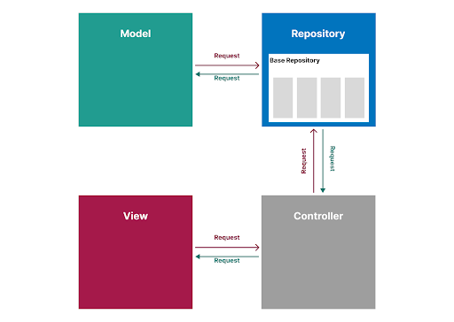

# Analyse conception 

## Introduction

## Analyse technique
### Technologies et outils

    
    
    
    
    
    
    

### Architecture de l'application

## Diagramme cas d'utilisation

## Diagramme de classe

## Références

[Diagramme cas d'utilisation](https://docs.google.com/presentation/d/1G8g-nuJnly97BBabZnEQrzzhvJ7ZOFd-rim_803nuq8/edit?usp=sharing)

[Diagramme de classe](https://online.visual-paradigm.com/share.jsp?id=333032313934332d31)