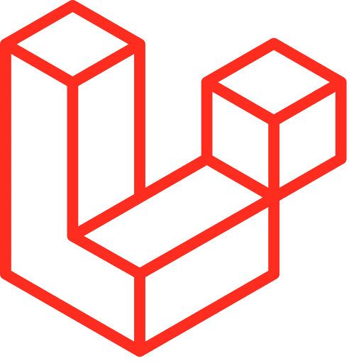
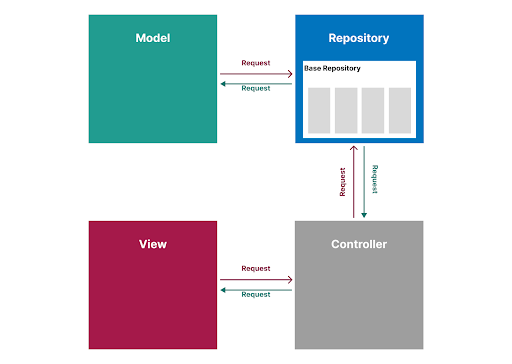
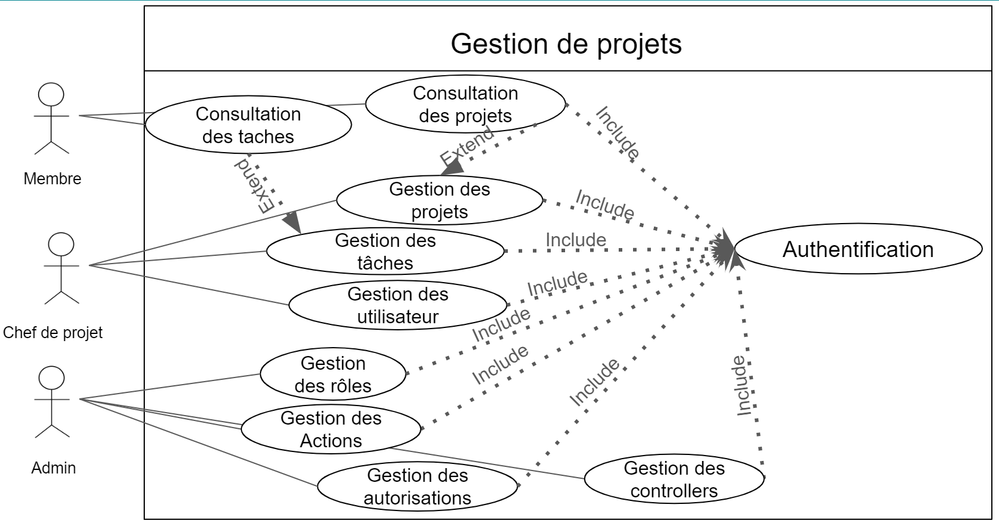
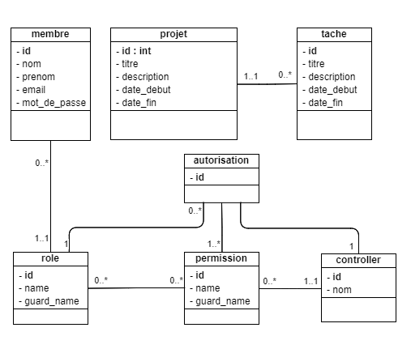

# Chapitre 2
## Analyse technique
 
### Technologies et outils

#### APACHE

- Serveur web
- Open Source

#### PHP

- Langage de programmation
- Orienté objet

#### LARAVEL

- Framework
- Architecture MVC
- i18n

#### MySQL

- Un serveur de bases de données relationnelles

#### AdminLTE

- Admin Dashboard
- Responsive Design
- Control Panel Thème

### Architecture de l'application

#### Repository Pattern

[Figure 1: Repository pattern ](./images/repository-pattern.png)

## Diagramme cas d'utilisation

[Figure 2: Diagramme de cas d'utilisation ](./images/user-case.png)

## Diagramme de classe

[Figure 3: Diagramme de classe](./images/diagramme-classe.png)

## Références 
[Diagramme cas d'utilisation](https://docs.google.com/presentation/d/1G8g-nuJnly97BBabZnEQrzzhvJ7ZOFd-rim_803nuq8/edit?usp=sharing)

[Diagramme de classe](https://online.visual-paradigm.com/share.jsp?id=333032313934332d31)
## Conclusion